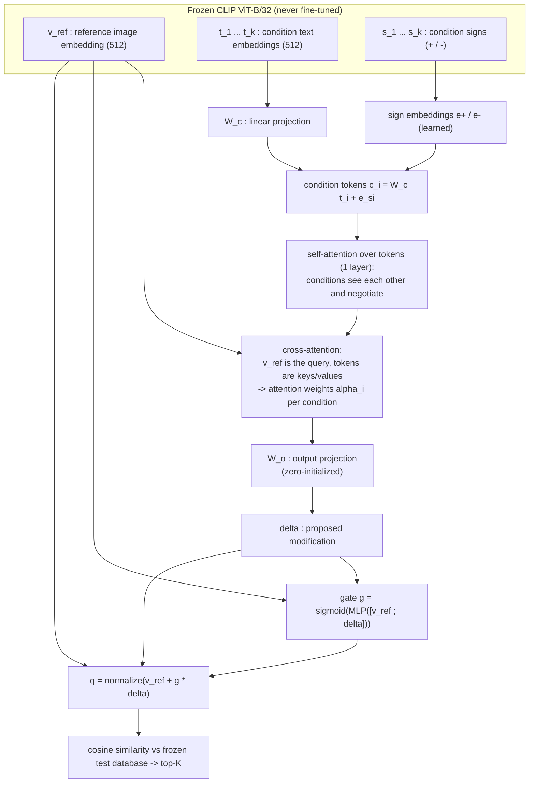
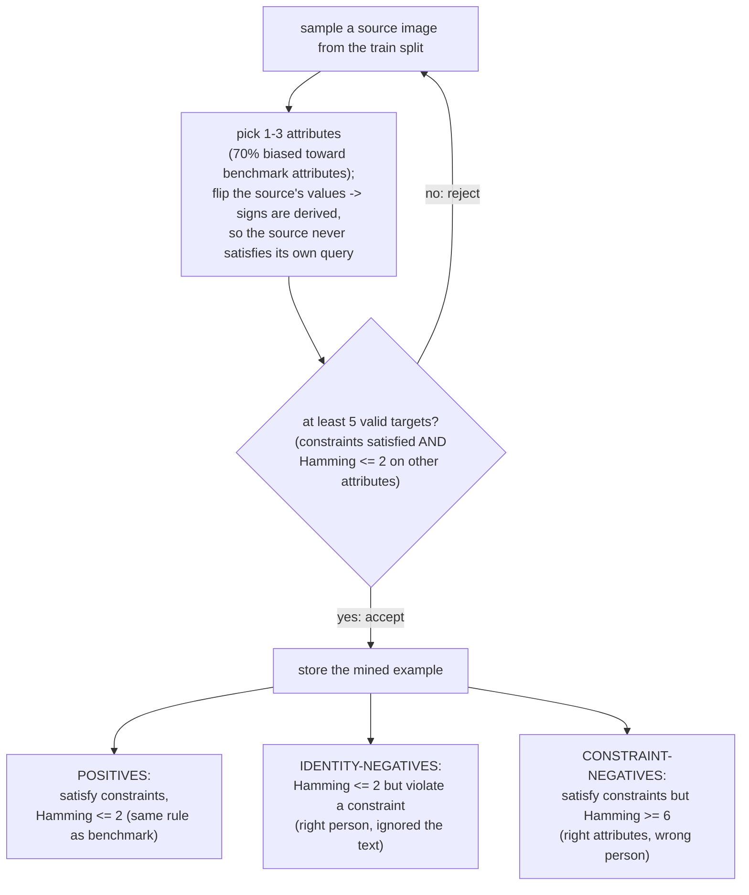

# Level 3 — design history of the fusion module

*(originally: "Gated Cross-Attention Fusion" — the deployed model has neither
cross-attention nor learned sign embeddings; see the status box below.)*

> **STATUS — superseded in part. Read `Project.ipynb` §8 and §10 first.**
>
> This document is the *design rationale as originally written*, before any of it
> had been run. The notebook has since tested every claim, and the deployed model
> no longer matches the architecture described below.
>
> **Deployed model:** self-attention + gate + mean-pooled condition tokens, sign
> encoded by negating the text embedding. 3.02M params.
> **R@10 = 0.338** (0.336 ± 0.016 over 5 seeds) vs 0.110 for the L1 baseline.
>
> | claim below | what the experiments found |
> |---|---|
> | Learned sign embeddings fix negation (F3) | **Dropped — redundant.** They looked catastrophic at `lr=1e-4`, but that was an optimisation artefact: the gap closes by `lr=1e-3`. Removing them is simpler and no worse. |
> | Image-conditioned cross-attention gives dynamic weighting (F1) | **Dropped.** Mean-pooling the condition tokens scores better (0.338 vs 0.311) with 25% fewer parameters, and holds 0.337 at `lr=2e-3` where cross-attention collapses to 0.105. |
> | Self-attention lets conditions negotiate (F2) | **Kept, but neutral** (−0.004, inside noise). |
> | The gate adapts the step size (F4) | **Supported — the one mechanism that earns its place.** Removing it costs −0.043 and triples seed variance. |
> | The residual structurally preserves identity | **Overstated.** Queries drift nearly orthogonal to the reference and retrieval concentrates on ~26% distinct images vs ~75% for the training-free levels. §10.5 shows forbidding this costs recall — the collapse is largely rational for a Hamming-based ground truth. |
>
> Not mentioned anywhere below, and larger than every effect above combined:
> **the learning rate was undertuned.** `1e-4 → 3e-4` is worth ~+0.08 R@10.
>
> **Cost of the simplification:** with cross-attention gone, per-condition weights
> are uniform by construction, so the attention-weight interpretability analysis
> is degenerate for the deployed model (§8.3).
>
> **Superseded again by §11 (2026-08-23), at a deeper level.** Everything in this
> document — and in Levels 1-3 — assumes the answer is a single composed query
> vector compared by cosine similarity. The assignment does not require that; it
> asks for a *dynamic similarity metric*. Section 11 shows the benchmark's ground
> truth is reproduced **exactly** by an attribute rule, and that scoring that rule
> directly in predicted-attribute space reaches **R@10 = 0.558** with 1.13M
> parameters, against 0.338 here. Adding this module's composed query on top of it
> is worth +0.007. §11.7 also gives this module the repair its own failure
> diagnosis implies (intra-modal condition tokens plus an explicit
> `<log_mu(v_ref), d_a>` satisfaction feature) and validation does not select it.
>
> What this module still has that §11's method does not: it accepts **arbitrary
> text conditions**, where the attribute method answers exactly CelebA's 40.
>
> The reasoning below is kept unchanged as a record of the design process. It is
> well-argued and largely unsupported by the experiments, which is why §10 and §11
> exist.

**Design notes, implementation choices, and sources of inspiration**

Companion document to `Project.ipynb` (§7). The notebook contains the runnable code and
the formal report; this document explains *why* the method looks the way it does, maps
every component to the deep-learning concepts it builds on, and cites the sources that
inspired each choice.

---

## 1. The problem we are solving

Given a reference face image and a set of signed attribute constraints
(e.g. `+Eyeglasses, -Smiling`), retrieve from the CelebA test split the images that
**keep the identity of the reference** while **satisfying every constraint**.

The obvious zero-shot solution (our mandatory Level 1 baseline) is latent arithmetic in
CLIP space:

$$\hat q = \mathrm{norm}\Big(v_{ref} + \sum_i s_i\, t_{a_i}\Big), \qquad s_i \in \{+1,-1\}$$

Analyzing why this fails tells us exactly what the learned model must fix. Each failure
mode below maps to one architectural component of Level 3:

| # | Failure of the baseline | Evidence / source | Level-3 component that addresses it |
|---|---|---|---|
| F1 | **Fixed weights**: every condition contributes with weight 1, whether or not the reference already satisfies it | Assignment brief (the pre-SVD stacking of CLAY is "architecturally rigid") | Cross-attention: weights depend on the reference image |
| F2 | **No interaction between conditions**: conflicting/correlated conditions (e.g. `+Wearing_Lipstick, -Heavy_Makeup`) are summed independently | CLAY (Lim et al., 2026) limitation named in the assignment | Self-attention over condition tokens |
| F3 | **Negation by subtraction**: CLIP behaves like a bag-of-words model cross-modally, so $-t_{smiling}$ is a crude proxy for "not smiling" | Yuksekgonul et al., ICLR 2023 | Learned sign embeddings |
| F4 | **Fixed step size**: how far to move away from the reference is not adaptive; too far destroys identity, too little changes nothing | Own analysis of the metric (targets must stay within Hamming ≤ 2 of the source) | Learned gate + residual connection |
| F5 | **Modality gap**: text and image embeddings live in two separate cones of the sphere, so text arithmetic moves the query partly in a meaningless direction | Liang et al., NeurIPS 2022 (modality gap); observed in our Level-2 experiments | The learned projection $W_c$ can map text tokens into a useful subspace; Level 2 addresses this training-free |

The assignment additionally fixes two hard constraints that shape everything:

- **The visual database stays frozen** (CLAY methodology): retrieval must remain a single
  cosine similarity against precomputed embeddings; only the *query* may be transformed.
- **The model must be lightweight**: we train ~4M parameters on precomputed 512-d
  embeddings; CLIP (≈150M parameters) is never fine-tuned. Training takes minutes.

---

## 2. Architecture

### 2.1 Condition tokens with learned sign embeddings (addresses F3)

$$c_i = W_c\, t_i + e_{s_i}, \qquad e_{+}, e_{-} \in \mathbb{R}^{512} \text{ learned}$$

Instead of encoding "remove attribute $a$" as $-t_a$ (the Euclidean opposite of "add
$a$", which CLIP does not honor), we *learn* what removal means: a shared embedding
vector added to the token, exactly like BERT's segment embeddings mark "sentence A vs
sentence B" (Devlin et al., 2019). The model is free to discover that "remove smiling"
should behave differently from "negative of smiling".

**Why additive and not concatenated?** Additive type embeddings keep the token dimension
at 512 (no reshaping anywhere) and are the standard, well-tested pattern from the
Transformer literature.

### 2.2 Self-attention over conditions (addresses F2)

One `nn.TransformerEncoderLayer` (Vaswani et al., 2017) lets the condition tokens attend
to each other *before* the image looks at them. This is where correlated or conflicting
constraints interact: in CelebA, `Wearing_Lipstick` and `Heavy_Makeup` are strongly
correlated, so `+Wearing_Lipstick, -Heavy_Makeup` requires the two tokens to "negotiate"
a direction that adds lipstick without adding makeup. A per-condition gating MLP
(our earlier design option B) cannot do this by construction, because each weight would
be computed independently of the other conditions.

**Why only 1 layer?** With at most $k=3$ tokens there is little depth to exploit; one
layer keeps the module lightweight (assignment requirement) and reduces overfitting
surface. This is an explicit capacity/regularization trade-off.

### 2.3 Cross-attention: the image queries the conditions (addresses F1)

$$\alpha = \mathrm{softmax}\!\Big(\tfrac{(W_q v_{ref})(W_k C)^\top}{\sqrt d}\Big), \qquad
\Delta = W_o\,(\alpha\, W_v C)$$

The reference embedding is the (single) attention query; the condition tokens are keys
and values (`nn.MultiheadAttention`, 4 heads). The attention weights $\alpha_i$ therefore
**depend on the image**: for the same query `+Eyeglasses & -Smiling`, a reference that
already looks serious yields $\alpha$ concentrated on `+Eyeglasses`. This is literally
the "dynamic control over how multiple conditions are weighted" that the assignment says
the naive pre-SVD stacking lacks — and the weights are interpretable, which feeds the
qualitative analysis in §8 of the notebook.

**Why attention and not a learned scalar per condition?** A scalar gate per condition
(computed from $[v_{ref}; t_i]$) weights conditions independently — it addresses F1 but
not F2. Attention gives both re-weighting *and* interaction in one standard, well-understood
mechanism, at a cost that is negligible for $k \le 3$ tokens.

### 2.4 Zero-initialized output projection (training stability)

$W_o$ starts as exactly zero (weights *and* bias), so at initialization:

$$\Phi(v_{ref}, \cdot) = \mathrm{norm}(v_{ref} + g \odot 0) = v_{ref}$$

The module is the **identity at step 0** — it starts from the (already reasonable)
reference embedding and only learns the *correction*. This is the zero-init residual
trick used by ReZero (Bachlechner et al., 2020) and by ControlNet's zero-convolutions
(Zhang et al., 2023): the network cannot be worse than its input at the start of
training, gradients flow through a well-conditioned residual path, and early training
does not destroy the retrieval signal. (Note: the gate MLP receives zero gradient at the
very first step because $\Delta = 0$; this self-heals from step 2 onward, once $W_o$ has
received its first nonzero update.)

### 2.5 Gated residual and re-normalization (addresses F4)

$$g = \sigma\big(\mathrm{MLP}([\,v_{ref}\,;\,\Delta\,])\big) \in (0,1)^{512}, \qquad
\hat q = \frac{v_{ref} + g \odot \Delta}{\lVert v_{ref} + g \odot \Delta \rVert}$$

The elementwise gate decides **how much** of the proposed modification to apply, as a
function of both the image and the modification itself. This is the gating idea of
LSTMs/Highway Networks (Hochreiter & Schmidhuber, 1997; Srivastava et al., 2015) applied
to a single fusion step; in composed image retrieval the same intuition appears in TIRG
(Vo et al., 2019), whose fusion is a gated combination of image features and a residual
text-conditioned term. Our design differs from TIRG in that the modification $\Delta$
comes from attention over *signed multi-condition* tokens rather than a single caption,
and everything operates on frozen CLIP embeddings.

The **residual form is a structural guarantee**, not a stylistic choice: the query can
never "forget" the reference, and preserving the reference identity is half of the task
(ground-truth targets must be within Hamming distance 2 of the source attributes).

The final L2 normalization is required for correctness, not cosmetics: the database
embeddings are unit-norm and retrieval is cosine similarity, so the query must live on
the same unit sphere.

**Division of labor (one sentence):** attention decides the *direction* of the
modification, the gate decides its *intensity*, the residual guarantees the *identity*.

---

## 3. Training

### 3.1 Where the supervision comes from (no manual labels, no leakage)

The key observation: the assignment *declares* the rule used to build the benchmark
ground truth (targets must satisfy the query constraints and be within relaxed Hamming
distance ≤ 2 on the remaining attributes; sources need ≥ 5 valid targets). We replicate
that exact rule on the **train split** (162,770 images, disjoint from the 19,962-image
test corpus) to mine unlimited supervision that is perfectly aligned with the evaluation:

Design decisions worth defending orally:

- **Signs are derived by flipping the source's attribute values.** For `+a` the source
  must lack $a$; this mirrors how the benchmark selects its sources and guarantees the
  query is never trivially satisfied by the source itself.
- **The ≥ 5-positives filter mirrors the benchmark's own inclusion rule**, so the
  training distribution matches the evaluation distribution.
- **No leakage**: the test split, the official queries, and the evaluation JSON are never
  touched during training or model selection. Validation uses a *disjoint pool of train
  sources* and retrieval over the train corpus (synthetic Recall@10).

### 3.2 The loss: InfoNCE with two kinds of hard negatives

$$\mathcal{L} = -\log
\frac{e^{\langle \hat q, v^+\rangle/\tau}}
{e^{\langle \hat q, v^+\rangle/\tau}
 + \sum_{v^- \in \mathrm{hard}} e^{\langle \hat q, v^-\rangle/\tau}
 + \sum_{j \neq i} e^{\langle \hat q, v_j^+\rangle/\tau}}$$

- **InfoNCE** (Oord et al., 2018) is the natural choice because our inference procedure
  *is* a similarity ranking: the loss directly maximizes the similarity of the composed
  query to a valid target relative to distractors — the same InfoNCE family CLIP itself
  was trained with (Radford et al., 2021), so we optimize the geometry the embeddings
  already live in.
- **Temperature $\tau = 0.07$** follows the convention established by MoCo/CLIP for
  unit-norm embeddings (He et al., 2020; Radford et al., 2021).
- **In-batch negatives** (the other samples' positives) come for free and provide easy
  distractors (Chen et al., 2020, SimCLR).
- **Mined hard negatives are the core supervision signal**, and their two types are not
  generic: they are constructed to punish *exactly the two ways retrieval can fail* —
  ignoring the text (identity-negatives) and ignoring the image (constraint-negatives).
  Hard-negative mining as a driver of metric learning goes back to FaceNet
  (Schroff et al., 2015); the importance of hardness in contrastive learning is analyzed
  by Robinson et al. (2021).

### 3.3 Optimization and model selection

| Choice | Value | Why |
|---|---|---|
| Optimizer | AdamW, lr $10^{-4}$, weight decay $10^{-2}$ | Standard for small transformer heads (Loshchilov & Hutter, 2019); decoupled weight decay regularizes the ~4M-parameter module trained on 30k examples |
| Batch size | 256 | Large batches improve InfoNCE (more in-batch negatives) at negligible memory cost on 512-d embeddings |
| Epochs / early stopping | ≤ 15, patience 3 on synthetic val R@10 | Model selection on a metric that matches the task (recall of a retrieval), computed without ever touching the benchmark |
| Hard negatives per example | 8 (4 + 4) | Balances the two failure modes; more would crowd out in-batch diversity |
| Training data | 30,000 mined examples (+2,000 validation from disjoint sources) | Enough for a 4M-parameter head; regenerable at zero labeling cost |

Everything trains on **precomputed frozen embeddings** — no CLIP forward pass during
training — which is what makes an epoch take seconds and iteration cheap (a deliberate
echo of CLAY's decoupling of visual features from conditioning).

---

## 4. Alternatives we considered and rejected

| Alternative | Why not |
|---|---|
| Fine-tuning CLIP (even partially, e.g. LoRA) | Violates the lightweight spirit of the assignment; risks destroying the pretrained geometry the frozen database depends on; expensive iteration |
| Re-implementing CLAY's SVD subspace projection | The assignment explicitly asks to go *beyond* the naive pre-SVD stacking; SVD on stacked conditions has no mechanism for image-dependent weighting (F1) or condition interaction (F2) |
| Gating-only MLP (per-condition scalar weights) | Simpler and interpretable, but structurally unable to model condition interactions (F2); we kept its best part — the gate — and attached it to attention |
| MLP over concatenated $[v_{ref}; \bar t]$ | Fixes the condition count or requires pooling that discards which condition is which; attention handles variable $k$ natively with padding masks |
| Training-free dynamic re-weighting (similarity-based weights at inference) | Addresses F1 partially but cannot learn negation (F3) or calibrated step sizes (F4); we cover the training-free space with Level 2 instead |

---

## 5. Source attribution

### 5.1 References from the notebook's bibliography that shaped Level 3

| Source | What Level 3 takes from it |
|---|---|
| **Lim et al., CVPR 2026 (CLAY)** | The frozen-visual-database setup (retrieval stays a cosine similarity against fixed embeddings; only the query is computed at inference); the explicitly named limitation — naive pre-SVD stacking of conditions — that the fusion module is designed to overcome |
| **Radford et al., ICML 2021 (CLIP)** | The embedding space itself (unit sphere, cosine similarity), the text encoder for condition prompts, prompt engineering for attribute phrases, the InfoNCE-style training precedent and the $\tau$ convention |
| **Oord et al., 2018 (InfoNCE / CPC)** | The training loss |
| **Yuksekgonul et al., ICLR 2023 (bag-of-words VLMs)** | The evidence that CLIP handles negation and composition poorly cross-modally — the direct motivation for learned sign embeddings instead of vector subtraction |
| **Liu et al., ICCV 2015 (CelebA)** | The 40 binary attribute annotations that make the triplet mining possible |
| **Berasi et al., CVPR 2025 (GDE)** | Mostly feeds Level 2 (geodesic composition); for Level 3 it contributes the framing that identity and attribute directions coexist in the visual embedding space |
| **Trager et al., ICCV 2023 (Linear spaces of meanings)** | Feeds Levels 1–2 (linear compositional structure); Level 3 is the learned counterpart of that linear assumption |

### 5.2 Classic deep-learning components used (added to the bibliography)

| Component in our module | Source of the idea |
|---|---|
| Self-/cross-attention blocks, multi-head attention | Vaswani et al., NeurIPS 2017, *Attention Is All You Need* |
| Additive type/sign embeddings on tokens | Devlin et al., NAACL 2019 (BERT segment embeddings) |
| Sigmoid gating of an update | Hochreiter & Schmidhuber, 1997 (LSTM); Srivastava et al., 2015 (Highway Networks) |
| Zero-initialized residual branch (identity at init) | Bachlechner et al., 2020 (ReZero); Zhang et al., ICCV 2023 (ControlNet zero-convolutions) |
| Hard-negative mining for metric learning | Schroff et al., CVPR 2015 (FaceNet); Robinson et al., ICLR 2021 |
| In-batch negatives, large-batch contrastive training | Chen et al., ICML 2020 (SimCLR); He et al., CVPR 2020 (MoCo, $\tau$ convention) |
| Decoupled weight decay | Loshchilov & Hutter, ICLR 2019 (AdamW) |
| Modality gap between image/text cones | Liang et al., NeurIPS 2022 |

### 5.3 Related work in composed image retrieval (conceptually adjacent, not used as a base)

| Work | Relation to ours |
|---|---|
| **Vo et al., CVPR 2019 (TIRG)** | The canonical gated image+text fusion for retrieval. Ours shares the gate+residual philosophy but differs in inputs (signed multi-condition tokens vs a single caption), in the fusion mechanism (attention vs concatenation-based gating), and in operating on frozen CLIP embeddings |
| **Baldrati et al., CVPR-W 2022 (CLIP4Cir combiner)** | Demonstrates that a small combiner trained contrastively on *frozen CLIP features* is effective for composed retrieval — the same efficiency regime we adopt; our conditioning structure (signs, multi-condition attention) is different |

**Provenance statement.** The code in `Project.ipynb` was written from scratch for this
project, building only on the course-provided skeleton (dataset setup and the
`evaluate_retrieval` metric). No third-party repository was used as a base. The works
cited above provided concepts and design patterns, not code.

---

## 6. FAQ — quick answers for the oral discussion

**Q: Why does retrieval stay a cosine similarity instead of a learned scoring network?**
Because the database must stay frozen (CLAY setup) and scoring 19,962 images per query
with a network would be orders of magnitude slower; a composed *query embedding* keeps
inference at one matrix multiplication.

**Q: What happens with a single condition ($k=1$)?**
Self-attention degenerates gracefully (a token attending to itself), cross-attention
puts weight 1 on the only token, and the model reduces to "project the condition, gate
it, add it" — a learned, calibrated version of the Level-1 baseline.

**Q: Why not use the Level-2 visual directions as tokens instead of text embeddings?**
It is a promising ablation (mentioned in the notebook): visual directions dodge the
modality gap. We kept text tokens as the primary input because they are what a real user
provides and what the assignment's problem statement specifies ($T^+, T^-$ are *textual*
constraints); $W_c$ can learn the cross-modal correction.

**Q: How do you know the model preserves identity rather than just matching attributes?**
Structurally, by the residual (the query is $v_{ref}$ plus a gated correction);
empirically, by the constraint-negatives in the loss (which punish matching attributes on
the wrong person) and by the Hamming-based ground truth of the benchmark itself.

**Q: Is the validation metric comparable to the benchmark metric?**
It is the same Recall@10 computation, but over the train corpus with mined queries —
slightly pessimistic (positives are capped at 256 per example) and on a different corpus
size, so it is used only for *relative* decisions (early stopping, model selection),
never quoted as a benchmark result.

**Q: Why temperature $\tau = 0.07$ in the InfoNCE loss?**
Cosine similarities of unit-norm embeddings live in $[-1, 1]$; without a small
temperature the softmax over that range is nearly flat and gradients vanish. Dividing by
$\tau = 0.07$ expands the logits to $[-14.3, +14.3]$. The specific value is the standard
convention for unit-norm contrastive learning (MoCo uses it fixed; CLIP initializes its
learnable temperature there), and it makes the loss hardness-aware — the gradient on each
negative scales with $e^{s_j/\tau}$, so the mined hard negatives actually dominate
training (Wang & Liu, CVPR 2021). Much lower values (e.g. 0.01) would over-punish false
negatives from the in-batch term. A learnable $\tau$ (as in CLIP) is a cheap one-line
ablation.

**Q: Why 4 attention heads and 512 dimensions?**
512 matches the CLIP embedding dimension, avoiding any extra projection at the
input/output boundary; 4 heads is the smallest standard head count that still gives the
attention some subspace diversity — with $k \le 3$ tokens, more heads add parameters
without more signal.
